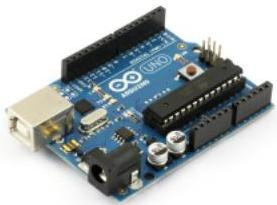

==========================================
Course Organization
==========================================

Welcome to ELEC1601 Computer Systems. In this document you will find a description of how the course is organized, the objectives, how the sessions will be conducted and assessment policy.

Sessions and Instructors
===========================

The sessions and rooms for these unit of study are:

+-----------------+------------------------+-----------------------------------------------+--------------------+
| **Session**     | **Date/Time**          | **Instructors**                               | **Venue**          |
+-----------------+------------------------+-----------------------------------------------+--------------------+
| Tutorial 1      | Mondays 12-2pm         | Harrison Nguyen Stephen Tridgell              | EE Blg Room 522    |
+-----------------+------------------------+-----------------------------------------------+--------------------+
| Tutorial 2      | Mondays 3-5pm          | Harrison Nguyen Stephen Tridgell              | EE Blg Room 522    |
+-----------------+------------------------+-----------------------------------------------+--------------------+
| Tutorial 3      | Tuesdays 9-11pm        | Stephen Tridgell Shilpitha Inguva             | EE Blg Room 522    |
+-----------------+------------------------+-----------------------------------------------+--------------------+
| Tutorial 4      | Tuesdays 12-2pm        | Shilpitha Inguva Jeffrey Mandryk              | EE Blg Room 522    |
+-----------------+------------------------+-----------------------------------------------+--------------------+
| Tutorial 5      | Wednesdays 9-11am      | Jeffrey Mandryk Bahareh Nazari                | EE Blg Room 522    |
+-----------------+------------------------+-----------------------------------------------+--------------------+
| Tutorial 6      | Thursdays 9-11am       | Harrison Nguyen Bahareh Nazari                | EE Blg Room 522    |
+-----------------+------------------------+-----------------------------------------------+--------------------+
| Tutorial 7      | Thursdays 11-1pm       | Jeffrey Mandryk Bahareh Nazari                | EE Blg Room 522    |
+-----------------+------------------------+-----------------------------------------------+--------------------+
| Lab 1           | Mondays 12-3pm         | Daniel Miller Smitha Shivshankar Nusrat Ahmed | EE Blg Room 265    |
+-----------------+------------------------+-----------------------------------------------+--------------------+
| Lab 2           | Tuesdays 3-6pm         | Daniel Miller Kolyan Teav Tuan Nguyen         | EE Blg Room 265    |
+-----------------+------------------------+-----------------------------------------------+--------------------+
| Lab 3           | Wednesdays 9-12pm      | Smitha Shivshankar Kolyan Teav Tuan Nguyen    | EE Blg Room 265    |
+-----------------+------------------------+-----------------------------------------------+--------------------+
| Lab 4           | Thursdays 9-12pm       | Smitha Shivshankar Kolyan Teav Nusrat Ahmed   | EE Blg Room 265    |
+-----------------+------------------------+-----------------------------------------------+--------------------+
| Lab 5           | Fridays 9-12           | Smitha Shivshankar Kolyan Teav Tuan Nguyen    | EE Blg Room 265    |
+-----------------+------------------------+-----------------------------------------------+--------------------+
| Lecture         | Fridays 12-2pm         | Abelardo Pardo                                | Merewether Rm 131  |
+-----------------+------------------------+-----------------------------------------------+--------------------+

|
|

The teaching staff is:

+----------------------+-------------------------+
| **Name**             |  **Responsibility/Time**|
+----------------------+-------------------------+
| Dr. Abelardo Pardo   | Lecturer                |
+----------------------+-------------------------+
| Dr. Johnson Thie     | Professional Officer    |
+----------------------+-------------------------+
| Stephen Tridgell     | Tutorials 1, 2, 3       |
+----------------------+-------------------------+
| Harrison Nguyen      | Tutorials 1, 2, 6       |
+----------------------+-------------------------+
| Shilpitha Inguva     | Tutorial 3, 4           |
+----------------------+-------------------------+
| Jeffrey Mandryk      | Tutorials 4, 5, 7       |
+----------------------+-------------------------+
| Bahareh Nazari       | Tutorials 5, 6, 7       |
+----------------------+-------------------------+
| Smitha Shivashankar  | Labs 1, 3, 4, 5         |
+----------------------+-------------------------+
| Keov Kolyan Teav     | Labs 2, 3, 4, 5         |
+----------------------+-------------------------+
| Anh Tuan Nguyen      | Labs 2, 3, 5            |
+----------------------+-------------------------+
| Nusrat Ahmed Surobhi | Labs 1, 4               |
+----------------------+-------------------------+
| Daniel Miller	       | Labs 1, 2               |
+----------------------+-------------------------+

|

- Lecturer office hours (Rm 554, Electrical Engineering Building, J03):
	- Wednesdays and Thursdays 2-3pm

Course Scenario
====================================
The activities in the course are all designed as if they were set in the following scenario. You are part of a department in a company that is considering the use of digital systems such as Arduino as their next strategic step. The company is thinking about moving into that space, but before doing so, they need to know in detail the technology, its potential, how feasible is to program, and possible applications.

The task for you and your team is to explore this possibility. You need to understand how digital systems work, the architecture of Arduino, its machine language, how to program it, how to connect other devices and sensors, how to read and write data from those sensors, become proficient with the tools to carry these tasks, and tests all of them in a practical project.

At the end of the semester you have to be able to explain to the company the possibilities of these systems and propose possible future applications.

Learning objectives and milestones
====================================
Although the main objective of the course is to demonstrate how to program and communicate with a digital system, there are some other objectives that we will cover along the way. More formally, at the end of the semester you will be able to:

A. demonstrate that you **understand** how computers work, from the digital logic level to how they execute basic programs,
B. **design**, build, configure, program and test an electronic system for a specific engineering problem observing common professional practice,
C. **write** reports about the design process and its results, and engage in **team-based** design and creative tasks to solve an engineering problem.
D. You can read a more detailed description of these skills and abilities in the online unit description.

We will achieve the previous objectives by learning about the following:

1. How computers encode all information they manipulate in binary logic.
2. How digital circuits are created to manipulate information encoded in binary format.
3. Which instructions are executed by computers and the steps required for that execution.
4. How to write programs in machine language (assembly).
5. How to design and configure a computer system (Arduino) using a high level programming language.

Course Material
====================================
All the course material will be available in electronic format. There are three resources for the course:

- a community in Blackboard,
- a discussion forum (hosted in a platform called Piazza),
- and the course notes (hosted in a different platform).

Make sure you become familiar with its structure, how to access them (go to lecture preparation material, tutorial activities, lab tasks, etc.), and keep those URLs handy.

Blackboard
-----------------
The course page in Blackboard shows the weekly schedule and links to the rest of the resources. Every week you will find there a link to the tasks for each of the sessions (lecture, lab and tutorial) together with a summary of what you have to do, and know by the end of the week.

|
|

Discussion forum (Piazza)
---------------------------
**Very important resource!** We would like you to participate in that forum by posting any questions you may have related to the course **or answering questions from your classmates**. The forum is designed so that you can get help fast and efficiently from either classmates or the instructors. Rather than emailing questions to the teaching staff, post them in this forum.

|

When posting, please take into account the following five rules:

a. Search before you post. Your question might have been asked already!
b. Choose an informative title for your post.
c. Be brief, spell check, and proof read.
d. No need to use capital letters nor emoticons.
e. Be courteous!

The forum offers instructors the possibility to label content as inappropriate.

Course Notes
---------------------------
Contain all the material covered in the course in HTML with special multimedia components such as videos and embedded questions. All pages in the notes contain links in the upper left area to access Blackboard, the discussion forum, weekly activities, and the list of topics covered in the course.

|

These notes are placed in a platform that is not fully integrated with Blackboard, and requires you to authenticate again with your University credentials.
